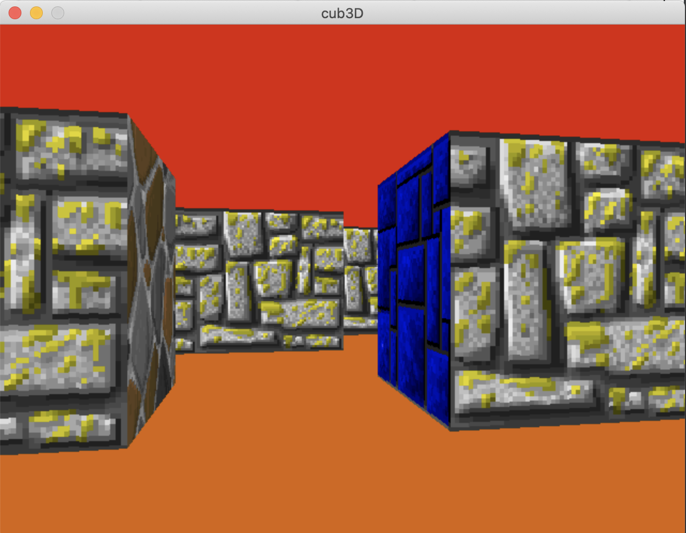

# cub3d

## 1. 소개
Ray casting을 이용하여 3D 프로그램을 만든 프로젝트입니다.
프로그램 조작 방법은 다음과 같습니다.
1. W A S D [방향키]
2. → ← ↑ ↓  [카메라 시점 전환]
3. esc [프로그램 종료]

## 2. 설치 및 실행  
본 프로젝트는 다음과 같은 환경에서 작성 되었습니다.

Apple clang version 12.0.0 (clang-1200.0.32.28)  
GNU Make 3.81  

1. 저장소를 복제합니다.

        https://github.com/42NoGun/cub3d.git
2. 컴파일 후 실행합니다.

        cd cub3d && make && ./cub3D map/valid/{map name}

## 3. 동작 원리
- 텍스쳐가 없는 벽면 레이케스트
1. parse map
  - 파일에서 게임 실행에 필요한 정보를 읽어 들여서 적절한 자료구조에 정보를 저장
2. initialize data
  - map file에서 필요한 정보를 구조체에 담는다
  - ex) 플레이어 정보, 텍스쳐 정보 등등
3. launch game
   1) 바닥, 천장 그리기
   - 화면의 아래쪽 절반은 floor색으로 칠하기
   - 화면의 위쪽 절반은 ceiling색으로 칠하기
   - 바닥과 천장을 그린후 그위에 벽을 덮어 쓰는 형식으로 그리기
   2) raycast (벽 그리기)
   - 현재 플레이어가 바라보는 방향을 기준으로 ray를 발사하여 벽을 찾아 내야 한다.
   - 벽을 찾는데는 DDA알고리즘을 사용한다.
   - 벽에 어떤 지점에 ray가 닿았는지 확인하여 추후 텍스쳐 표현에 사용한다.
   - 찾아낸 벽과 현재 플레이어 위치 사이의 거리를 구한다.
   - 구한 거리를 가지고 실제 화면에 얼마 만큼의 길이로 수직선을 그릴지 판단한다.
   - 구해낸 텍스쳐의 x, y좌표를 가지고 화면에 수직선을 그린다.
   - 해당 과정을 화면의 전체 x값(수직선의 위치)에 대해 반복 한다.
   
   3) 이미지 출력
   - 수직선을 하나의 이미지로 만들고 화면에 이미지를 출력한다.
